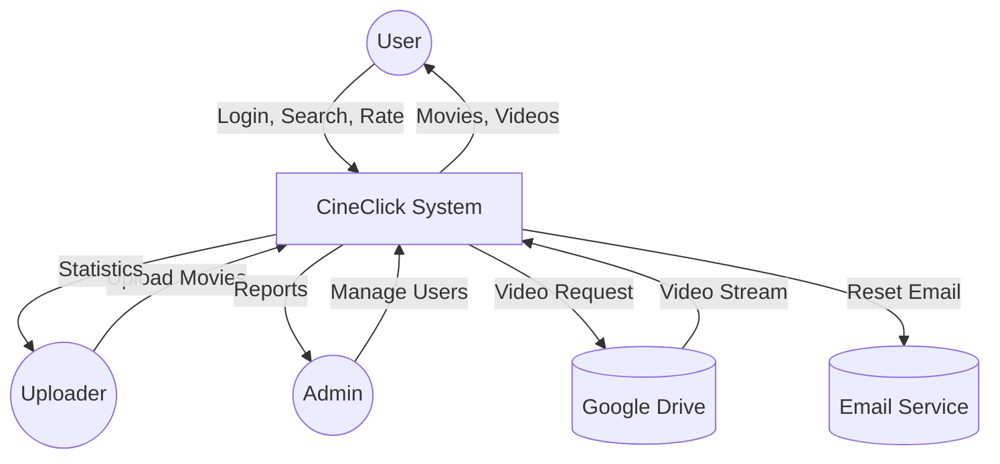
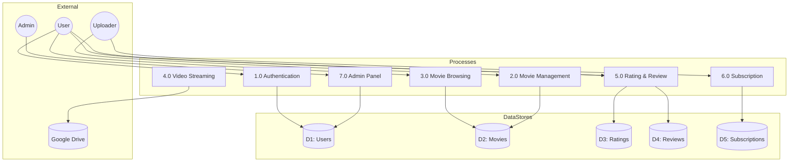

# CineClick - Data Flow Diagram (DFD) Prompts

## 📊 Comprehensive DFD Prompts for AI Tools

Use these prompts with Draw.io, Lucidchart, ChatGPT, or any AI diagram generator to create professional DFDs for your CineClick project.

---

## 📋 Table of Contents

1. [Context Diagram (Level 0)](#1-context-diagram-level-0)
2. [Level 1 DFD](#2-level-1-dfd)
3. [Level 2 DFD - Subsystems](#3-level-2-dfd---subsystems)
4. [Text-Based DFD Representations](#4-text-based-dfd-representations)
5. [DFD Symbols Reference](#5-dfd-symbols-reference)

---

## 1. Context Diagram (Level 0)

### Prompt for Context Diagram

```
Create a Context Diagram (DFD Level 0) for a movie streaming application called "CineClick".

External Entities:
1. User (Regular user who browses and watches movies)
2. Uploader (Content creator who uploads movies)
3. Admin (System administrator)
4. Google Drive (External video storage service)
5. Email Service (For password reset)

Central Process:
- CineClick System (Process 0)

Data Flows:

From User to System:
- Login credentials
- Registration data
- Search queries
- Movie rating (1-5 stars)
- Movie review text
- Subscription request
- Password change request

From System to User:
- Authentication result
- Movie list/search results
- Movie details
- Video stream URL
- Rating confirmation
- Subscription status

From Uploader to System:
- Login credentials
- Movie details (title, description, genre)
- Video link (Google Drive)
- Thumbnail link
- Subscription pricing

From System to Uploader:
- Upload confirmation
- Movie statistics (views, ratings)
- Subscriber list
- Revenue data

From Admin to System:
- Login credentials
- User role changes
- User deletion requests
- Content moderation actions

From System to Admin:
- User list
- System statistics
- Activity logs
- Pending uploader requests

From System to Google Drive:
- Video file request

From Google Drive to System:
- Video stream data

From System to Email Service:
- Password reset email request

From Email Service to System:
- Email delivery status

Style: Use circles for processes, rectangles for external entities, and arrows for data flows. Use standard DFD notation.
```

### Context Diagram - Text Representation

```
                    ┌─────────────┐
                    │   Admin     │
                    └──────┬──────┘
                           │
          Admin credentials, User management
                           │
                           ▼
┌─────────┐         ┌─────────────────┐         ┌─────────────┐
│  User   │◀───────▶│                 │◀───────▶│  Uploader   │
└─────────┘         │                 │         └─────────────┘
     │              │   CineClick     │              │
     │              │    System       │              │
     │              │   (Process 0)   │              │
     │              │                 │              │
     │              └────────┬────────┘              │
     │                       │                       │
     │              ┌────────┴────────┐              │
     │              │                 │              │
     │              ▼                 ▼              │
     │      ┌─────────────┐   ┌─────────────┐       │
     │      │Google Drive │   │Email Service│       │
     │      └─────────────┘   └─────────────┘       │
     │                                              │
     └──────────────────────────────────────────────┘
```

---

## 2. Level 1 DFD

### Prompt for Level 1 DFD

```
Create a Level 1 Data Flow Diagram for "CineClick" movie streaming application.

Processes:
1.0 User Authentication
   - Handle login, registration, password reset
   - Validate credentials
   - Manage sessions

2.0 Movie Management
   - Upload movies (uploaders)
   - Store movie metadata
   - Delete movies

3.0 Movie Browsing
   - Search movies
   - Filter by genre
   - Sort by views/rating/date
   - Display movie list

4.0 Video Streaming
   - Retrieve video from Google Drive
   - Track view count
   - Manage playback

5.0 Rating & Review System
   - Submit ratings (1-5 stars)
   - Write reviews
   - Calculate average ratings (via database triggers)

6.0 Subscription Management
   - Subscribe to uploaders
   - Manage subscription plans
   - Process payments

7.0 Admin Panel
   - Manage users
   - Approve uploader requests
   - View system statistics

Data Stores:
D1: Users (user accounts, roles, passwords)
D2: Movies (movie catalog, metadata)
D3: Ratings (user ratings)
D4: Reviews (user reviews)
D5: Subscriptions (subscriber relationships)
D6: Password History (previous passwords)
D7: Activity Log (user activities)
D8: Password Reset Tokens (reset tokens)

External Entities:
E1: User
E2: Uploader
E3: Admin
E4: Google Drive
E5: Email Service

Data Flows between processes and data stores should be clearly labeled with the type of data being transferred.

Style: Standard DFD notation with numbered processes, labeled data flows, and proper data store symbols.
```

### Level 1 DFD - Text Representation

```
                              ┌─────────┐
                              │  User   │
                              │  (E1)   │
                              └────┬────┘
                                   │
              ┌────────────────────┼────────────────────┐
              │                    │                    │
              ▼                    ▼                    ▼
        ┌───────────┐       ┌───────────┐       ┌───────────┐
        │    1.0    │       │    3.0    │       │    5.0    │
        │   User    │       │  Movie    │       │  Rating   │
        │   Auth    │       │ Browsing  │       │ & Review  │
        └─────┬─────┘       └─────┬─────┘       └─────┬─────┘
              │                   │                   │
              │                   │                   │
              ▼                   ▼                   ▼
        ═══════════         ═══════════         ═══════════
        ║   D1    ║         ║   D2    ║         ║ D3 & D4 ║
        ║  Users  ║         ║ Movies  ║         ║Ratings/ ║
        ═══════════         ═══════════         ║Reviews  ║
              │                   │              ═══════════
              │                   │                   │
              │                   ▼                   │
              │            ┌───────────┐              │
              │            │    4.0    │              │
              │            │  Video    │◀─────────────┘
              │            │ Streaming │
              │            └─────┬─────┘
              │                  │
              │                  ▼
              │           ┌─────────────┐
              │           │Google Drive │
              │           │    (E4)     │
              │           └─────────────┘
              │
              ▼
        ┌───────────┐       ┌───────────┐
        │    2.0    │       │    6.0    │
        │  Movie    │       │Subscription│
        │Management │       │Management  │
        └─────┬─────┘       └─────┬─────┘
              │                   │
              ▼                   ▼
        ┌─────────┐         ═══════════
        │Uploader │         ║   D5    ║
        │  (E2)   │         ║Subscript║
        └─────────┘         ═══════════

        ┌───────────┐
        │    7.0    │
        │  Admin    │◀──────────┐
        │  Panel    │           │
        └─────┬─────┘           │
              │            ┌─────────┐
              ▼            │  Admin  │
        ═══════════        │  (E3)   │
        ║   D7    ║        └─────────┘
        ║Activity ║
        ║  Log    ║
        ═══════════
```

---

## 3. Level 2 DFD - Subsystems

### 3.1 User Authentication Subsystem (Process 1.0)

```
Create a Level 2 DFD for the User Authentication subsystem of CineClick.

Sub-processes:
1.1 Login Processing
    - Validate username/email
    - Verify password hash
    - Create session
    - Log login activity

1.2 Registration Processing
    - Validate input data
    - Check email uniqueness
    - Hash password
    - Create user account
    - Log registration

1.3 Password Reset
    - Generate reset token
    - Send email via Email Service
    - Validate token
    - Update password
    - Store old password in history

1.4 Password Change
    - Verify current password
    - Validate new password strength
    - Check password history (last 5)
    - Update password
    - Log activity

Data Stores:
D1: Users
D6: Password History
D7: Activity Log
D8: Password Reset Tokens

External Entity:
E5: Email Service

Data Flows:
- Login credentials → 1.1 → Session data
- Registration data → 1.2 → Account created
- Reset request → 1.3 → Email sent
- New password → 1.4 → Password updated
```

### 3.2 Movie Management Subsystem (Process 2.0)

```
Create a Level 2 DFD for Movie Management subsystem.

Sub-processes:
2.1 Movie Upload
    - Receive movie details from uploader
    - Validate video link (Google Drive)
    - Store metadata in database
    - Initialize rating stats (via trigger)

2.2 Movie Update
    - Retrieve existing movie data
    - Update title, description, genre
    - Update video/thumbnail links

2.3 Movie Deletion
    - Verify ownership/admin rights
    - Remove movie record
    - Cascade delete ratings/reviews

Data Stores:
D2: Movies
D3: Ratings
D4: Reviews
D9: Movie Rating Stats

Data Flows:
- Movie details → 2.1 → Upload confirmation
- Updated details → 2.2 → Update confirmation
- Delete request → 2.3 → Deletion confirmation
```

### 3.3 Rating & Review Subsystem (Process 5.0)

```
Create a Level 2 DFD for Rating & Review subsystem.

Sub-processes:
5.1 Submit Rating
    - Receive rating (1-5 stars)
    - Store/update in ratings table
    - Trigger updates movie_rating_stats

5.2 Submit Review
    - Receive review text
    - Validate user hasn't reviewed before
    - Store in reviews table

5.3 Display Ratings/Reviews
    - Fetch average rating
    - Fetch all reviews for movie
    - Return formatted data

Data Stores:
D3: Ratings
D4: Reviews
D9: Movie Rating Stats (cached)

Data Flows:
- Rating value → 5.1 → Rating stored, stats updated
- Review text → 5.2 → Review stored
- Movie ID → 5.3 → Ratings & reviews data
```

---

## 4. Text-Based DFD Representations

### Complete System Data Flow (Simplified)

```
┌─────────────────────────────────────────────────────────────────────────────┐
│                           CineClick System DFD                              │
└─────────────────────────────────────────────────────────────────────────────┘

EXTERNAL ENTITIES                 PROCESSES                    DATA STORES
================                 ==========                    ===========

┌─────────┐                    ┌───────────┐
│  USER   │───Login Data──────▶│   1.0     │──────────────▶ ═══════════
│         │◀──Auth Result──────│   Auth    │◀──────────────  ║ D1:Users║
│         │                    └───────────┘                 ═══════════
│         │
│         │───Search Query────▶┌───────────┐
│         │◀──Movie List───────│   3.0     │◀──────────────▶ ═══════════
│         │                    │  Browse   │                 ║D2:Movies║
│         │                    └───────────┘                 ═══════════
│         │
│         │───Watch Request───▶┌───────────┐     ┌─────────────┐
│         │◀──Video Stream─────│   4.0     │◀───▶│Google Drive │
│         │                    │  Stream   │     └─────────────┘
│         │                    └───────────┘
│         │
│         │───Rating/Review───▶┌───────────┐
│         │◀──Confirmation─────│   5.0     │◀──────────────▶ ═══════════
│         │                    │ Rate/Rev  │                 ║D3:Rating║
└─────────┘                    └───────────┘                 ║D4:Review║
                                                             ═══════════

┌──────────┐                   ┌───────────┐
│ UPLOADER │───Movie Data─────▶│   2.0     │
│          │◀──Upload Status───│  Upload   │──────────────▶ ═══════════
│          │                   └───────────┘                ║D2:Movies║
│          │                                                ═══════════
│          │───Pricing────────▶┌───────────┐
│          │◀──Subscribers─────│   6.0     │◀──────────────▶ ═══════════
└──────────┘                   │Subscribe  │                ║D5:Subs  ║
                               └───────────┘                ═══════════

┌─────────┐                    ┌───────────┐
│  ADMIN  │───Management──────▶│   7.0     │
│         │◀──Statistics───────│  Admin    │◀──────────────▶ ═══════════
│         │                    │  Panel    │                ║D7:ActLog║
└─────────┘                    └───────────┘                ═══════════
```

---

## 5. DFD Symbols Reference

### Standard DFD Notation

| Symbol | Name | Description | Example |
|--------|------|-------------|---------|
| ○ or ◯ | Process | Transforms data | 1.0 Authentication |
| □ | External Entity | Source/destination of data | User, Admin |
| ═══ or ▭ | Data Store | Where data is stored | D1: Users |
| → | Data Flow | Movement of data | Login credentials |

### Numbering Convention

```
Level 0: Context Diagram
- Single process (0 or "System")

Level 1: Major Processes
- 1.0, 2.0, 3.0, etc.

Level 2: Sub-processes
- 1.1, 1.2, 1.3 (under 1.0)
- 2.1, 2.2, 2.3 (under 2.0)

Data Stores:
- D1, D2, D3, etc.

External Entities:
- E1, E2, E3, etc.
```

---

## 6. Quick Reference - All Data Flows

### User Flows
| From | To | Data Flow |
|------|-----|-----------|
| User | 1.0 Auth | Login credentials, Registration data |
| 1.0 Auth | User | Auth result, Session token |
| User | 3.0 Browse | Search query, Filters |
| 3.0 Browse | User | Movie list, Movie details |
| User | 4.0 Stream | Watch request |
| 4.0 Stream | User | Video URL, Stream data |
| User | 5.0 Rating | Rating (1-5), Review text |
| 5.0 Rating | User | Confirmation |
| User | 6.0 Subscribe | Subscription request |
| 6.0 Subscribe | User | Subscription status |

### Uploader Flows
| From | To | Data Flow |
|------|-----|-----------|
| Uploader | 2.0 Upload | Movie details, Video link |
| 2.0 Upload | Uploader | Upload confirmation |
| Uploader | 6.0 Subscribe | Pricing settings |
| 6.0 Subscribe | Uploader | Subscriber list, Revenue |

### Admin Flows
| From | To | Data Flow |
|------|-----|-----------|
| Admin | 7.0 Admin | User management, Role changes |
| 7.0 Admin | Admin | User list, Statistics, Logs |

### System to Data Store Flows
| Process | Data Store | Read/Write |
|---------|------------|------------|
| 1.0 Auth | D1 Users | R/W |
| 1.0 Auth | D6 Password History | R/W |
| 1.0 Auth | D7 Activity Log | W |
| 1.0 Auth | D8 Reset Tokens | R/W |
| 2.0 Upload | D2 Movies | R/W |
| 3.0 Browse | D2 Movies | R |
| 4.0 Stream | D2 Movies | R |
| 5.0 Rating | D3 Ratings | R/W |
| 5.0 Rating | D4 Reviews | R/W |
| 6.0 Subscribe | D5 Subscriptions | R/W |
| 7.0 Admin | All Stores | R/W |

---

## 7. Recommended Tools

### For Drawing DFDs
1. **Draw.io** (free) - diagrams.net
2. **Lucidchart** - lucidchart.com
3. **Microsoft Visio**
4. **Creately**
5. **EdrawMax**

### AI Tools for DFD Generation
1. **ChatGPT** - Describe and generate text-based DFDs
2. **Mermaid** - Code-based diagrams
3. **PlantUML** - Text to diagram
4. **Eraser.io** - AI diagram generation

---

## 8. Mermaid Code for DFDs

### Context Diagram (Mermaid)



### Level 1 DFD (Mermaid)



---

## 9. PlantUML Code

```plantuml
@startuml CineClick_DFD
!define ENTITY(x) actor x
!define PROCESS(x) usecase x
!define DATASTORE(x) database x

ENTITY(User)
ENTITY(Uploader)
ENTITY(Admin)

rectangle "CineClick System" {
    PROCESS("1.0\nAuthentication") as P1
    PROCESS("2.0\nMovie Upload") as P2
    PROCESS("3.0\nBrowsing") as P3
    PROCESS("4.0\nStreaming") as P4
    PROCESS("5.0\nRating") as P5
    PROCESS("6.0\nSubscription") as P6
    PROCESS("7.0\nAdmin") as P7
}

DATASTORE("D1: Users") as D1
DATASTORE("D2: Movies") as D2
DATASTORE("D3: Ratings") as D3

User --> P1 : Login
User --> P3 : Search
User --> P5 : Rate
P1 --> D1
P3 --> D2
P5 --> D3

Uploader --> P2 : Upload
P2 --> D2

Admin --> P7 : Manage
P7 --> D1
@enduml
```

---

**Use these prompts and code snippets to generate professional DFDs for your CineClick project documentation! 📊**
